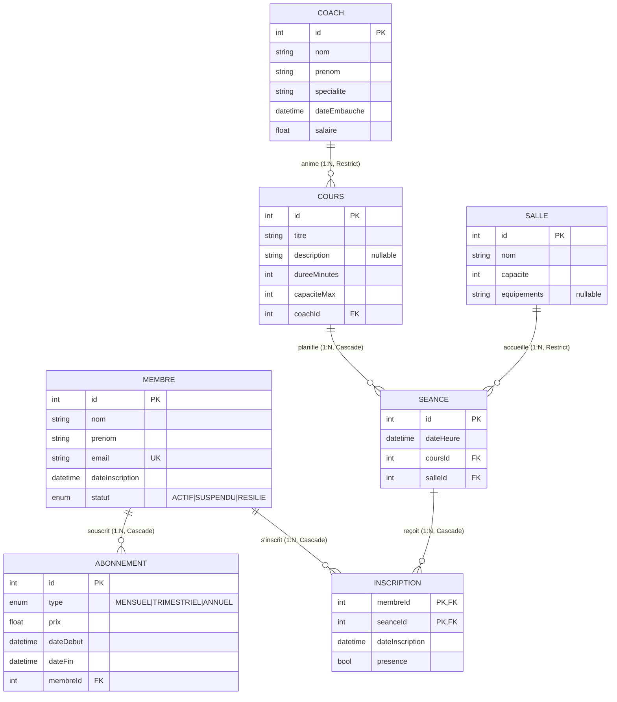

# Schéma de la base de données

## Relations détaillées

| De     | Vers        | Cardinalité | onDelete  | Justification                                              |
| ------ | ----------- | ----------- | --------- | ---------------------------------------------------------- |
| Coach  | Cours       | 1:N         | Restrict  | On refuse de supprimer un coach avec cours actifs          |
| Cours  | Seance      | 1:N         | Cascade   | Sans le cours, les séances n'ont plus de sens              |
| Salle  | Seance      | 1:N         | Restrict  | On ne supprime pas une salle utilisée                      |
| Membre | Abonnement  | 1:N         | Cascade   | RGPD : effacer un membre = effacer son historique          |
| Membre | Inscription | 1:N         | Cascade   | Idem                                                       |
| Seance | Inscription | 1:N         | Cascade   | Si la séance est annulée, plus d'inscriptions associées    |
| Membre | Seance      | N:M         | via Inscription | Table explicite pour stocker dateInscription + presence |
